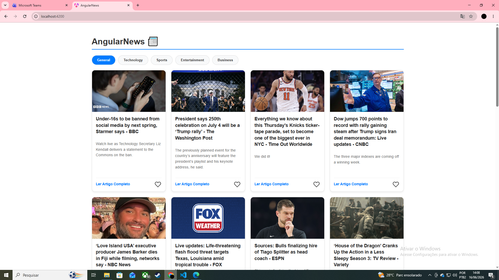
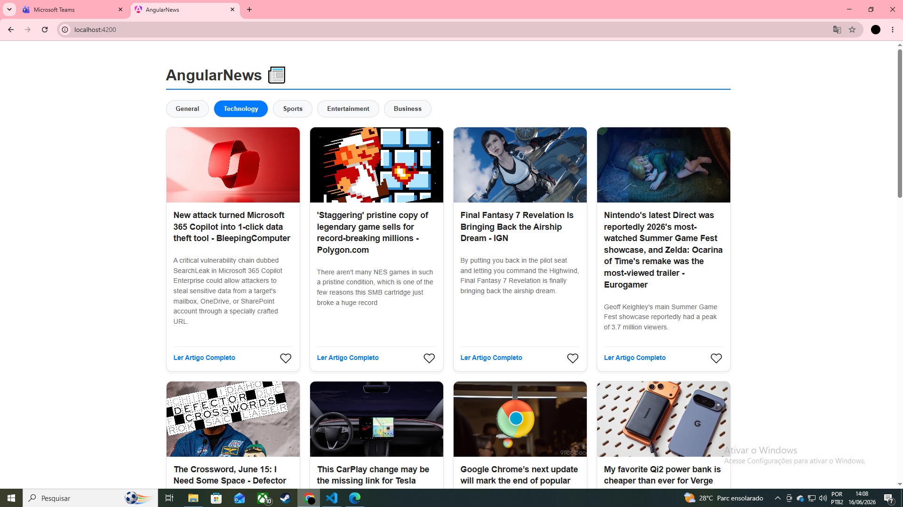
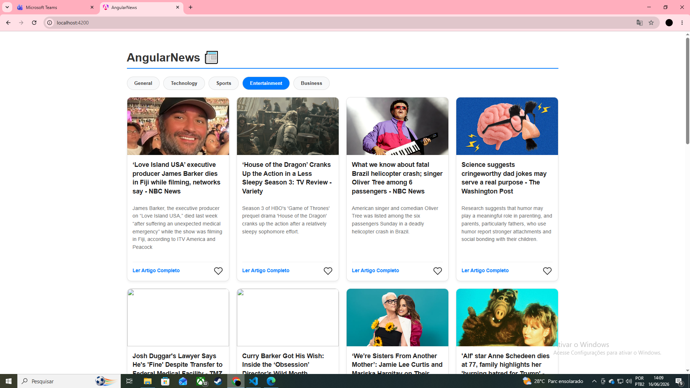

## 🚀 Funcionalidades Implementadas

* **Integração com API de Notícias**: Consumo da REST NewsAPI (`https://newsapi.org/`) utilizando serviços assíncronos do Angular para listagem de artigos em tempo real.
* **Interface Responsiva**: Estrutura adaptável para visualização limpa e fluida em múltiplos tamanhos de tela.
* **Filtros Personalizados**: Botões dinâmicos que permitem alternar instantaneamente o feed entre categorias de interesse.
* **Gerenciamento de Favoritos**: Recurso para salvar e remover artigos prediletos com persistência de dados local.
* **Cache e Performance Offline**: Sistema de armazenamento em Local Storage para guardar as requisições, diminuindo chamadas desnecessárias à API e garantindo experiência offline.

---

## 📸 Demonstração do Projeto (Prints de Tela)


### 1. Feed Principal - Categoria Geral


### 2. Filtrando por Tecnologia


### 3. Favoritando Artigos e Responsividade


## 🛠️ Requisitos Técnicos Utilizados

* **Framework:** Angular (Standalone Components)
* **Linguagem:** TypeScript
* **API Principal:** NewsAPI pública
* **Persistência:** Local Storage para Cache e Favoritos

## 🔧 Como Executar a Aplicação Localmente

1. Certifique-se de ter o **Node.js** e o **Angular CLI** instalados.
2. Clone este repositório público:
   ```bash
   git clone [https://github.com/luiz-hsa/AngularNews.git](https://github.com/luiz-hsa/AngularNews.git)